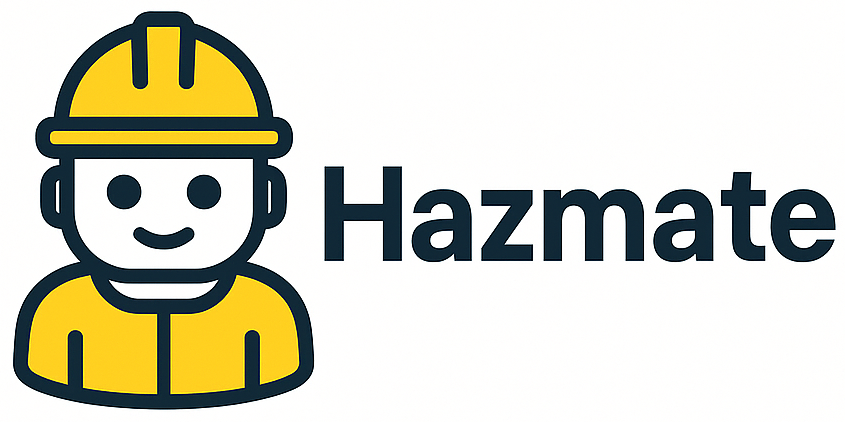

# Take-Home Test for GenAI Positions - IT Hazmat Team

This project is a take-home test for the GenAI positions at IT Hazmat.

The solution repository is available at https://github.com/ruancomelli/hazmate.

<!-- TODO: make this repo public! -->

<!-- TODO: extend this section -->

<!-- TODO: create more sections for each part of the project -->

## Project Structure

## Execution

### Authentication and Authorization

For authentication, I used the OAuth 2.0 flow.

- step 1: start the redirect server with `uv run -m hazmate.redirect_server`
- step 2: expose the redirect server to the internet with `./scripts/start_ngrok.sh`. I've set up a free ngrok domain for this project, so the redirect URL is the same for everyone.
- step 3: set the `REDIRECT_URL` environment variable in the `.env` file as `REDIRECT_URL = "https://wealthy-optionally-anemone.ngrok-free.app/callback"`

The OAuth flow starts automatically when the application is run.

## Devlog

### Data Collection

To build the dataset of potential hazmat items, I decided to use MercadoLibre's API.

#### Authorization

<!-- TODO: explain why I preferred the API over scraping; namely: more reliable, allows me to send queries, less complicated, less chance of getting blocked, simpler to implement, etc. -->

This was honestly the single most time-consuming part of the project. I spent a lot of time trying to figure out how to set up the redirect URL to receive the authorization code and manage the authorization code, access tokens, and refresh tokens.

I also ended up using a local server to receive the access token and refresh token.

#### Interacting with the API

To build the dataset, I will send requests to several Meli API endpoints:

- `https://api.mercadolibre.com/products/search`
- `https://api.mercadolibre.com/products/$PRODUCT_ID`
- `https://api.mercadolibre.com/sites/$SITE_ID/categories`
- `https://api.mercadolibre.com/categories/$CATEGORY_ID`
- `https://api.mercadolibre.com/categories/$CATEGORY_ID/attributes`

In order to build type-safe queries, I created a `pydantic` model for each endpoint by first sending sample queries to the API, saving the responses to a file, and then asking Cursor to create the relevant Pydantic models. See the conversation in [`cursor-chats/cursor_create_pydantic_model_for_mercad.md`](cursor-chats/cursor_create_pydantic_model_for_mercad.md).

See [`examples/queries`](examples/queries) for examples of how to use the type-safe queries.

#### Building the dataset

<!-- Relevant chat: https://chatgpt.com/share/685c82d0-05f0-8009-88d4-76a4105c4702 -->

The dataset construction process involves several key decisions and optimizations:

**API Data Sources Comparison:**
After analyzing both the `/products/search` and `/products/{id}` endpoints, I discovered that neither API response is strictly richer than the other - they contain complementary information:

- **SearchResult** provides: `keywords` (search terms) and `description` (basic product info)
- **Product** provides: `short_description` (detailed product description), `family_name`, and `permalink`

**Dataset Design Decisions:**

1. **Dual API Strategy**: Instead of using just one API endpoint, the final dataset combines information from both by making additional Product API calls for the items found through search.

2. **Focus on Text Content**: For hazmat detection, textual information is most valuable. The combined approach ensures we capture:

   - Search keywords that might indicate hazardous materials
   - Basic descriptions from search results
   - Rich, detailed product descriptions from the product API
   - Structured attributes and main features

3. **Removed Image Analysis**: Initially considered including product images, but decided to focus on text-based classification for this project. This simplifies the model architecture and reduces complexity.

4. **Required vs Optional Fields**: Made fields like `permalink` and `family_name` required since they're always available in the Product API and provide valuable context for hazmat detection.

**Data Structure**: The final `InputDatasetItem` model includes:

- Product identification (ID, name, domain, family name, permalink)
- Textual content (description, short description, keywords)
- Structured attributes (materials, safety info, etc.)
- Main product features

This approach ensures we have the richest possible dataset for training hazmat classification models while maintaining data quality and consistency.

<!--
TODO:

### Inference

### Evaluation

One idea: items have attributes that can give us 100% accuracy - like "is flammable: true". This is good because it allows us to build an evaluation set.

### Deployment

### Updating
-->

<!-- TODO: write the following in a readable and structured way:

I am not much worried about catastrophic forgetting because:

- I am not fine-tuning models
- I am not chaining messages indefinitely (as would happen in a chatbot)
- ...?

 -->

## Feedback

<!-- TODO: give them some feedback on the challenge? -->
