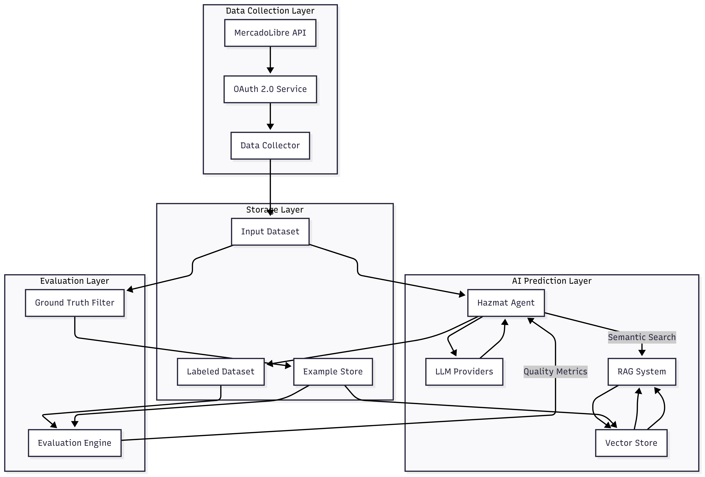

# MercadoLibre GenAI Take-Home Challenge

## Hazmat Detection System - Technical Report


**Candidate**: Ruan Cardoso Comelli<br/>
**Position**: GenAI Software Engineer - IT Hazmat Team<br/>
**Repository**: https://github.com/ruancomelli/hazmate<br/>
**Predictions**: https://drive.google.com/file/d/1d7pFJNltG0GuLHyaE-UGXxPfXY7zwdKQ/view?usp=sharing<br/>
**Date**: 2025-06-27

---

## Executive Summary

This report documents my approach to solving MercadoLibre's hazmat detection challenge. The goal is to build a system that can identify hazardous materials in product listings and explain why certain items need special shipping handling.

I built a classification system using Large Language Models (LLMs) optionally enhanced with Retrieval-Augmented Generation (RAG). The system can process product descriptions and determine whether items contain hazardous materials, while providing human-readable explanations for each decision.

**Accomplishments:**

- Successfully collected 100,000 real products from MercadoLibre's API, covering diverse categories that might contain hazmat items. This required overcoming significant technical challenges including OAuth token expiration and API endpoint limitations.
- Implemented a RAG-enhanced classification system that combines the generative capabilities of LLMs with a knowledge base of human-labeled examples.
- Achieved 97.3% accuracy on definitive hazmat items (identified through product attributes) without RAG.
- Developed an evaluation strategy using MercadoLibre's own product attributes as ground truth, allowing reliable assessment of model performance without time-consuming manual labeling.

## Setup Instructions

**Prerequisites:**

- [uv](https://docs.astral.sh/uv/) - A Python package and project manager
- Python 3.13 or newer - can be managed with uv

Verify that `uv` is correctly installed by running `uv --version`.

**Clone the repository:**

```bash
git clone https://github.com/ruancomelli/hazmate.git
cd hazmate
```

**Configure environment variables:**

For authentication, this project needs the variables `CLIENT_ID`, `CLIENT_SECRET` and `REDIRECT_URL` to be set.

For agent execution and embeddings, the variables `GOOGLE_API_KEY`, `ANTHROPIC_API_KEY` and `OPENAI_API_KEY` are needed depending on the model used.

A sample `.env.example` file is provided in the root of the repository. Copy it to `.env` and fill in the values.

**Run the redirect server and tunnel with ngrok:**

```bash
uv run -m hazmate.redirect_server
```

```bash
bash scripts/start_ngrok.sh
```

**Run examples:**

Example scripts are available in the [`examples/`](https://github.com/ruancomelli/hazmate/tree/main/examples) directory. Each example can be run using `uv run examples/<example_name>`.

## Development Process

### Data Collection

#### Data collection strategy: MercadoLibre's API

I chose to work with MercadoLibre's public API rather than using web scraping for several practical reasons: First, it's much more reliable - APIs give you structured data in a predictable format, whereas web scraping is fragile and breaks whenever the website changes. Second, I'm less likely to get blocked or rate-limited when using official endpoints. Third, this is closer to what a production system would receive as input: well-structured data.

#### OAuth 2.0 authentication

To access the API, I needed to authenticate using OAuth 2.0. The [API documentation](https://developers.mercadolivre.com.br/pt_br/autenticacao-e-autorizacao) provided a guide for the authentication process, but I needed to implement a custom solution to handle the token expiration. Due to the fact that access tokens expire in 5 minutes, the data collection stage could not be reliably executed in a single run.

To solve this, I obtained a static domain from ngrok and used it to handle the redirect callback. The ngrok domain pointed to a Flask server running locally. Finally, managing the authorization code, access token, and refresh token was performed by adding `requests-oauthlib` as a dependency to the project.

#### The multi-endpoint data fusion approach

During the initial analysis, it became evident that no single API endpoint provided complete information for the data collection requirements. The following endpoints were utilized:

```
/sites/{site_id}/categories           # All categories in the site
/categories/{category_id}             # Category structure
/categories/{category_id}/attributes  # Attribute definitions
/products/search                      # Product discovery (primary functional endpoint)
/products/{product_id}                # Detailed product information
```

The categories endpoints provided access to MercadoLibre's product taxonomy structure. The search endpoint enabled product discovery, albeit through alternative query-based methods rather than the initially planned category-filtered approach. The detailed product endpoint delivered comprehensive descriptions and structured attribute data about each product.

#### Data Collection Implementation

The data collection process required navigating several technical challenges and API limitations to successfully gather 100,000 diverse product samples.

**API exploration and taxonomy analysis**

I developed `list_all_subcategories.py` to systematically explore MercadoLibre's category structure and available product attributes. This analysis revealed a comprehensive taxonomy with detailed attribute definitions for each category, confirming the feasibility of building a diverse, well-structured dataset.

**API endpoint limitations**

Initial attempts to use category-filtered search endpoints (`/site/$SITE_ID/items/search?category=$CATEGORY` and `/site/$SITE_ID/items/search?q=$QUERY`) consistently returned 403 Forbidden errors. After extensive testing with different authentication approaches and request parameters, I concluded that these endpoints were likely unavailable with the current application permissions, and a different approach was needed.

**Alternative search strategy**

The solution was to use the accessible `/products/search` endpoint, which requires query-based rather than category-based filtering. This necessitated creating targeted search queries to simulate category-specific collection, leading to the development of the [`hazmat-collector-config.yaml`](https://github.com/ruancomelli/hazmate/blob/main/hazmat-collector-config.yaml) configuration file.

I used [ChatGPT](https://chatgpt.com/share/685c82d0-05f0-8009-88d4-76a4105c4702) to generate targeted search queries that would capture products from specific categories. For example, instead of filtering by "automotive accessories," I created queries like "óleo automotivo," "fluido de freio," "bateria carro," etc. This approach required Portuguese search terms that would naturally surface products from each target category.

**Category selection strategy**

Category selection focused on areas where hazmat items might realistically appear alongside regular products. I excluded vehicles (different logistics requirements), books/music/films (no hazmat considerations), and services/events (non-physical products).

**Query expansion and optimization**

Initial query generation provided insufficient coverage for the 100,000-item target. I expanded the query list significantly using Cursor assistance, adding more search terms per category and including specific hazmat-focused queries in the `extra_queries` section of the `hazmat-collector-config.yaml` file. The final configuration contains over 800 search terms designed to maximize category coverage.

**OAuth token management challenges**

MercadoLibre's OAuth tokens expire every 5 minutes, creating significant challenges for long-running data collection processes. Initial collection attempts would fail mid-process when tokens expired, requiring the incorporation of automatic token refresh. This became a critical component for successful large-scale data collection.

**Collection strategy trade-offs: balanced vs. speed**

The data collection script implements two distinct strategies addressing different priorities in dataset construction.

The "balanced" approach ensures equal representation across categories, with systematic rotation through categories and queries to prevent any single category from dominating the dataset. Within each category, it maximizes diversity of product families and attributes. This approach optimizes for data quality and representativeness rather than collection speed, ensuring the model receives a comprehensive sample across all product types.

The "speed" approach prioritizes collection efficiency while maintaining reasonable category coverage. It optimizes batching strategies, accepting less strict per-category quotas in favor of faster overall collection.

To run both strategies, use the following commands:

```bash
# Balanced approach for analysis and validation
uv run -m hazmate.input_datasets -o "data/inputs/input_items_small.jsonl" --target-size 100 --goal balance

# Speed-optimized approach for full dataset
uv run -m hazmate.input_datasets -o "data/inputs/input_items_full.jsonl" --target-size 100_000 --goal speed
```

The balanced small dataset provides precise distribution statistics across categories, families, and attributes, validating that the speed-optimized full dataset maintains adequate balance across the dimensions relevant for hazmat detection.

**Examples**

Examples of the outputs of each endpoint can be found in the [`examples/queries/`](https://github.com/ruancomelli/hazmate/tree/main/examples/queries) directory. Each example can be run using `uv run examples/queries/<example_name>`.

### Building the Classification System

#### Model architecture selection: LLMs vs traditional ML

The choice between Large Language Models and traditional machine learning approaches represented a key architectural decision with significant implications for training requirements and explainability.

Hazmat detection requires sophisticated understanding of complex product descriptions and their relationship to safety regulations. Traditional ML approaches would likely struggle with this level of domain knowledge integration and semantic reasoning, especially without proper training data. LLMs can one-shot this task with a satisfactory accuracy.

Explainability requirements strongly favored LLM implementation. The system must provide clear justifications for hazmat classifications to support human review and audit processes. LLMs generate human-readable explanations naturally as part of their output, while traditional ML models would require separate interpretability frameworks.

The final consideration for deciding on LLMs over traditional ML was the alignment with the current goals of the Hazmat IT Team: since the team is currently exploring the use of LLMs to classify hazmat items, it was a natural choice to use LLMs for this project.

To keep the scope of this project manageable, I decided not to explore LLM fine-tuning. Instead, I focused on using the LLM as a classifier, with a RAG-based approach to provide extra context when needed.

#### Structured output for traceability

The key insight was that every prediction needed to be traceable and explainable. To achieve this, I defined [a Pydantic model](https://github.com/ruancomelli/hazmate/blob/main/src/hazmate/agent/predictions.py) for the output of the LLM:

```python
class HazmatPrediction(BaseModel):
    item_id: str                   # Links back to the original product
    is_hazmat: bool                # Clear binary decision
    traits: list[HazmatTrait]      # Specific hazards identified
    reason: str                    # Human-readable explanation
```

This structure ensures that every decision can be audited, and the reasoning can be reviewed by human experts.

#### Model selection

I chose to use Gemini 2.5 Flash Lite, as it is one of the most cost-effective models currently available.

I considered using models from OpenAI and Anthropic, but the cost-effectiveness of Gemini 2.5 Flash Lite made it the clear choice. Additionally, local models (running via `ollama`) ran very slowly on my machine, making them impractical to use for this project.

#### Execution

The results CSV file can be generated with the following command:

```bash
uv run -m hazmate.agent \
    -m google-gla:gemini-2.5-flash-lite-preview-06-17 \
    -i data/inputs/input_items_full.jsonl \
    -o data/predictions/full_gemini-2.5-flash-lite_v1.jsonl \
    --batch-size 100 \
    --max-input-tokens 400_000 \
    --parallel-batches 10
```

This will generate a JSONL file at `data/predictions/full_gemini-2.5-flash-lite_v1.jsonl`.
To transform it into a CSV file, run the following command:

```bash
uv run scripts/convert_jsonl_to_csv.py \
    data/predictions/full_gemini-2.5-flash-lite_v1.jsonl \
    data/predictions/full_gemini-2.5-flash-lite_v1.csv
```

### Evaluating Predictions

In order to reliably evaluate the performance of the classification system, a ground truth dataset is needed. However, pre-labeled datasets for this domain are not readily available, and manually labeling 100,000 products was not feasible in the time available.

My solution was to leverage MercadoLibre's own product attributes to identify definitive hazmat cases with high confidence. Products with explicit hazmat-indicating attributes provide unambiguous ground truth labels. For example, products marked "É inflamável: Sim" represent clear hazmat cases.

The [`hazmat-attributes-config.yaml`](https://github.com/ruancomelli/hazmate/blob/main/hazmat-attributes-config.yaml) file contains a list of attributes that are known to be indicative of hazmat products. This list was used by the [`filter_hazmat_items.py`](https://github.com/ruancomelli/hazmate/blob/main/scripts/filter_hazmat_items.py) script to filter the input dataset and generate a ground truth dataset, enabling predictions to be evaluated against a known set of hazmat items in [`evaluate_on_hazmat.py`](https://github.com/ruancomelli/hazmate/blob/main/scripts/evaluate_on_hazmat.py).

This approach provides high-confidence ground truth labels for a subset of products. While not comprehensive (hazmat products without explicit attributes exist), the method ensures reliability in detecting true positives and false negatives.

To generate the ground truth dataset, run the following command:

```bash
uv run scripts/filter_hazmat_items.py \
    -i data/inputs/input_items_full.jsonl \
    -o data/ground_truth/hazmat_full.jsonl
```

Finally, to evaluate the predictions against the ground truth dataset, run the following command:

```bash
uv run scripts/evaluate_on_hazmat.py \
    -g data/ground_truth/hazmat_full.jsonl \
    -p data/predictions/full_gemini-2.5-flash-lite_v1.jsonl \
    --detailed
```

This will print a report like the following - which shows the final accuracy of the classification system:

```
==================================================
EVALUATION SUMMARY
==================================================
Ground-truth hazmat items: 1826
Items with predictions: 1826
Items without predictions: 0
Correctly identified as hazmat: 1776 (97.3%)
False negatives (missed hazmat): 50 (2.7%)
Accuracy: 97.3%
```

### RAG

I implemented a RAG-based approach to enhance the classification system, though it was limited by API constraints.

The RAG system is implemented using ChromaDB and LangChain. The system retrieves similar products from the knowledge base that have been manually labeled by domain experts - or, in this case, the ground truth dataset. The LLM then leverages these concrete examples to inform classification decisions.

However, I very quickly ran into daily rate limits of the APIs of all the providers I tried (OpenAI, Anthropic, Google), making it impractical to use for the full 100,000-item dataset. The RAG implementation works correctly for smaller batches and serves as a proof-of-concept for future production implementations with proper API quotas.

An example of the RAG-enhanced predictions can be found in the [`examples/agents/agent.py`](https://github.com/ruancomelli/hazmate/blob/main/examples/agents/agent.py) script, and an example of the "examples store" can be found in the [`examples/agents/examples_store/`](https://github.com/ruancomelli/hazmate/tree/main/examples/agents/examples_store) directory.

## System Architecture



#### Data Collection Layer

The data collection layer handles external data ingestion from MercadoLibre's API. The OAuth 2.0 Service manages authentication and token refresh, while the Data Collector gathers product information from multiple endpoints and transforms raw API responses into structured input items.

#### AI Prediction Layer

The Hazmat Agent coordinates the classification workflow, managing batch processing and prompt construction. The agent performs hazmat classification with human-readable explanations. The RAG System enhances accuracy by retrieving similar labeled products using an embedding model and a vector store for semantic similarity search.

#### Evaluation Layer

The Ground Truth Filter identifies definitive hazmat products using MercadoLibre's attributes to build a ground truth dataset. The Evaluation Engine compares predictions against ground truth to generate quality metrics for monitoring and performance analysis.

#### Storage Layer

The Input Dataset stores collected product information. The Labeled Dataset contains predictions alongside their corresponding input for traceability. The Example Store maintains expert-labeled (or ground truth) products for RAG enhancement.

#### Data Flow Architecture

Product data flows from MercadoLibre API → Data Collection → AI Prediction (with optional RAG enhancement) → Classification Output. This project relies on the following infrastructure:

- **LLM Providers**: OpenAI, Anthropic, Google for classification models
- **Storage**: Input datasets, predictions with traceability, expert examples, and quality metrics
- **Vector Database**: ChromaDB for efficient similarity search and retrieval

## Technical Implementation Details

### RAG Enhancement Architecture

The Retrieval-Augmented Generation component addresses the gap between general LLM knowledge and domain-specific nuances in MercadoLibre's product catalog. While Gemini 2.5 Flash Lite demonstrates strong understanding of hazmat concepts generally, human expertise can be leveraged through specific examples and edge cases encountered in real product data.

The system implements a knowledge base using ChromaDB and LangChain that stores human-labeled (or, in this case, ground truth) examples of hazmat and non-hazmat products:

```python
# RAG implementation with ChromaDB + LangChain
example_store = ExampleStore.from_embedding_model_name_and_persist_directory(
    embedding_model_name="google:models/gemini-embedding-exp-03-07",
    persist_directory="data/examples"
)

# Retrieve similar examples for context
similar_examples = example_store.retrieve(input_item, count=3)
```

During classification, the system first retrieves similar products from the knowledge base that have been manually labeled. The LLM then leverages these concrete examples to inform classification decisions.

Key benefits include integrating human expertise to improve accuracy, handling similar products consistently, and updating knowledge easily by adding new examples instead of retraining.

### Structured Prompting

The prompting structure is designed to enumerate the most important hazmat categories and traits, and then provide a list of examples of hazmat and non-hazmat products obtained via the RAG system (if enabled). The LLM is then instructed to use the examples to inform its classification decision.

```python
def get_system_prompt(self, include_examples_rag: bool = False) -> str:
    base_prompt = """
    You are a hazardous materials (Hazmat) classification expert...

    Hazardous materials include but are not limited to:
    - Flammable liquids, solids, and gases
    - Explosive materials and fireworks
    - Corrosive substances (acids, bases)
    - Toxic or poisonous materials
    ...
    """

    if include_examples_rag:
        base_prompt += """
        ENHANCED CLASSIFICATION WITH EXAMPLES:
        1. First, use the retrieve_similar_examples tool
        2. Analyze the product considering similar examples
        3. Make classification decision with example references
        """
```

Due to the time constraints of this project, I did not perform prompt engineering - however, I did write the prompts following the best practices I learned from my previous experience with LLMs.

### Catastrophic Forgetting Prevention

The architectural decisions made for this hazmat detection system fundamentally mitigate the risk of catastrophic forgetting. Most importantly, the system is designed to be stateless, meaning that each classification request is handled independently, without any persistent state or learned parameters that could be overwritten.

The deliberate decision to use pre-trained models exclusively through API calls rather than implementing custom fine-tuning means that the core model weights remain unchanged throughout the system's operation, eliminating the primary mechanism through which catastrophic forgetting occurs.

The RAG knowledge base serves as an external memory system that persists across all sessions and updates. Unlike traditional machine learning approaches where knowledge is encoded in model weights, this system stores domain expertise in a structured format that can be retrieved and referenced without risk of overwriting. When new examples are added to the knowledge base, they supplement rather than replace existing knowledge.

### Human Expert Integration

The system is able to integrate human expertise through a continuous feedback loop that leverages domain knowledge to improve classification accuracy. Domain experts contribute by providing labeled examples that are added to the RAG knowledge base.

```python
# Human experts provide labeled examples
labeled_examples = [
    HazmatLabeledItem(
        item_id="EXPERT001",
        name="Acetone Nail Polish Remover",
        is_hazmat=True,
        traits=[KnownHazmatTrait.FLAMMABLE, KnownHazmatTrait.TOXIC],
        reason="Contains acetone - highly flammable liquid (Class 3)..."
    )
]

# Add to knowledge base for RAG enhancement
example_store.add_batch(labeled_examples)
```

### Bottlenecks and Mitigation

Several bottlenecks were identified during the development of this project, and some others are expected to be encountered in a production environment. The following are some of the most significant ones that I have personally identified, either by running the system locally or through previous work experience:

**LLM API Rate Limits:**

- **Issue**: LLM providers rate limiting requests
- **Mitigation**: Multi-provider load balancing, model fallback, batching items to reduce the number of requests

**MercadoLibre API Constraints:**

- **Issue**: OAuth token expiration every 5 minutes disrupts data collection
- **Mitigation**: Automated token refresh service (implemented), request retry logic, connection pooling

**Memory Usage:**

- **Issue**: Large batch processing consuming excessive RAM
- **Mitigation**: Dynamic batch sizing based on available memory, streaming processing, memory-mapped file access

**Storage I/O:**

- **Issue**: Vector database queries creating disk I/O bottlenecks during concurrent requests
- **Mitigation**: In-memory vector caching

**Human Expert Feedback Loop:**

- **Issue**: Manual review delays knowledge base updates and costs time for the experts
- **Mitigation**: Expert review queue prioritization, batch review interfaces

## Future Enhancements

### Multi-Modal Analysis

This project currently uses only text data, primarily for simplicity and cost-effectiveness. However, analyzing product images could significantly improve the classification accuracy, especially since several LLMs are now multi-modal.

### Knowledge Base

Currently, knowledge is added to the system via contributions to the RAG vector store. However, it does not include normative or technical information that could further improve accuracy. Such documents could be made available to the LLM through the Model Context Protocol (MCP). Maintaining a document store that is updated regularly would be another effective way to enhance accuracy and integrate human expertise.

### Hallucination Control Techniques

One technique to mitigate hallucination is to require the classification agent to provide a list of the sources it used to make its prediction. This evidence list can then be audited to ensure the system is not hallucinating. For example, the Judge LLM pattern achieves this by introducing another agent responsible for reviewing the evidence list and verifying that the sources are sufficient and relevant.

## Conclusion

This technical challenge demonstrates a working proof-of-concept for hazmat detection that successfully addresses the key requirements defined by MercadoLibre. While not yet production-ready, the solution provides a solid foundation that could be evolved into a production system with additional engineering effort.

**Key Accomplishments:**

- Successfully collected 100,000 real products from MercadoLibre's API, overcoming significant technical challenges such as OAuth limitations and endpoint restrictions
- Built a functional LLM-based classification system achieving 97.3% accuracy on definitive hazmat cases without fine-tuning
- Developed a simple yet effective evaluation methodology using product attributes as ground truth, enabling reliable performance assessment without manual labeling
- Implemented a RAG architecture to enhance classification with domain-specific examples
- Produced comprehensive documentation of the approach, challenges, and architectural decisions

The foundation established here provides a clear path forward for building a production-grade hazmat detection system.
